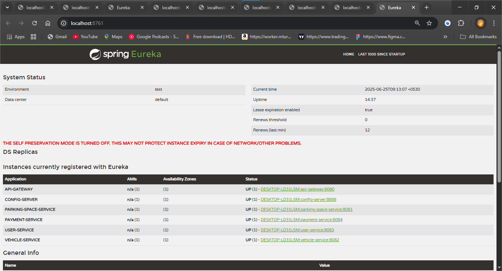

# Smart Parking Management System (SPMS)


Urban centers are plagued by traffic congestion, wasted fuel, and lost productivity—much of it caused by inefficient parking management. The **Smart Parking Management System (SPMS)** is a cloud-native, microservice-driven platform engineered to address these challenges. SPMS empowers drivers to find, reserve, and pay for parking in real time, enables owners to manage spaces dynamically, and simulates secure payments—all while supporting city-wide analytics and sustainable mobility.

## 🎯 Key Business Objectives

- **Reduce urban congestion** and emissions by streamlining parking search and allocation.
- **Boost efficiency** for drivers and parking owners with real-time space management.
- **Enable digital transformation** of parking operations for municipalities and private providers.
- **Deliver actionable insights** through analytics on space usage by city, zone, and owner.

## 🏗️ Solution Architecture

SPMS is built on a modular, scalable microservices architecture, ensuring flexibility, maintainability, and rapid deployment. The system leverages Spring Boot for core services, with optional support for Node.js or Python microservices as needed.

| Component             | Technology               | Role & Functionality                                      |
|-----------------------|--------------------------|-----------------------------------------------------------|
| **Service Registry**  | Spring Cloud Eureka      | Dynamic service discovery and registration                |
| **Config Server**     | Spring Cloud Config      | Centralized, versioned configuration management           |
| **API Gateway**       | Spring Cloud Gateway     | Unified entry point, routing, and security                |
| **Parking Service**   | Spring Boot              | Manage, reserve, and release parking spaces               |
| **Vehicle Service**   | Spring Boot              | Register vehicles, track entry/exit, link to users        |
| **User Service**      | Spring Boot              | User registration, authentication, and profile management |
| **Payment Service**   | Spring Boot              | Simulate transactions, validate payments, issue receipts  |
| **Testing**           | Postman                  | Comprehensive API validation and scenario testing         |

## ⚙️ Core Features

- **Dynamic Space Allocation:** Reserve and release parking spots in real time.
- **Live Availability Tracking:** Monitor spot status via manual updates or IoT integrations.
- **Digital Transactions:** Simulate secure payments and generate digital receipts.
- **Comprehensive Analytics:** Analyze usage by city, zone, and owner for data-driven decisions.
- **Entry/Exit Simulation:** Log and audit vehicle movements for security and reporting.
- **Historical Logs:** Maintain complete booking and transaction history for users & admins.

## 🧑‍💻 Quick Start Guide

### 1. Clone the Repository

```sh
git clone https://github.com/orion343dream/Smart-Parking-Management-System.git
cd SPMS
```

### 2. Launch the Configuration Server

```sh
cd config-server
mvn spring-boot:run
```

### 3. Start the Eureka Service Registry

```sh
cd eureka-server
mvn spring-boot:run
```

### 4. Run the API Gateway

```sh
cd api-gateway
mvn spring-boot:run
```

### 5. Deploy Microservices (in separate terminals)

```sh
cd parking-service
mvn spring-boot:run

cd vehicle-service
mvn spring-boot:run

cd user-service
mvn spring-boot:run

cd payment-service
mvn spring-boot:run
```

## 🧪 Testing & Validation

- **API Testing:**  
  Use the provided Postman collection to validate and explore all backend endpoints.  
  [Postman Collection](./postman-collection.json)

- **Eureka Service Registry:**  
  Visualize and confirm active microservices.  
  

```
SPMS/
├─ config-server/
├─ eureka-server/
├─ api-gateway/
├─ parking-service/
├─ vehicle-service/
├─ user-service/
├─ payment-service/
├─ postman_collection.json
├─ docs/
│  └─ screenshots/
│     └─ eureka_dashboard.png
└─ README.md
```

## 💡 Implementation Highlights

- **Microservice Best Practices:**  
  Each service is independently deployable, stateless, and communicates via REST APIs, ensuring high cohesion and low coupling.

- **Scalability & Maintainability:**  
  Centralized configuration and dynamic service discovery enable seamless scaling and updates without downtime.

- **Security & Robustness:**  
  Authentication and authorization are handled at the API gateway and user service levels. All payment flows are simulated for safe testing.

- **Testing-First Approach:**  
  All APIs are thoroughly validated using Postman, with edge cases and error handling included in the test suite.

## 🏙️ Why SPMS?

- **Solves real urban problems:** Reduces congestion, emissions, and driver frustration.
- **Promotes digital transformation:** Supports smart city initiatives and data-driven management.
- **Highly extensible:** Easily integrates IoT sensors and new services as urban needs evolve.
